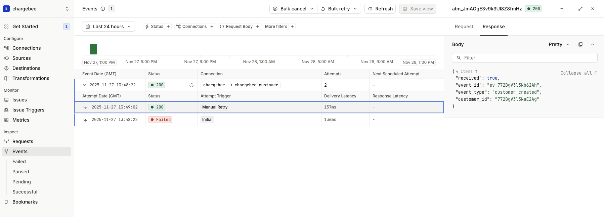

# Reliable Subscription & Customer Automation with Chargebee Webhooks and the Hookdeck Event Gateway

Chargebee webhooks enable business automation around your subscription lifecycle. You can provision access when subscriptions are created, update user entitlements when plans change, extend access on successful renewals, sync customer data to internal systems, track revenue from payments, and trigger email notifications for lifecycle events.

This tutorial shows you how to build reliable handlers for subscription, customer, and payment events. You create focused handlers for each event type and use event routing to separate concerns in your application.

Webhook reliability challenges impact these workflows directly. Network failures result in missed provisioning. Duplicate events risk double-charging or double-provisioning. Debugging webhook issues delays time-sensitive operations. Without proper infrastructure, managing these workflows is error-prone.

This tutorial uses the [Hookdeck Event Gateway](https://hookdeck.com/event-gateway?ref=chargebee) to address these problems. The Event Gateway provides automatic retries, duplicate detection, event routing, and observability. You configure Chargebee to send all events to a single Event Gateway endpoint, which routes them to the appropriate handlers in your application.

```
Chargebee → Hookdeck Event Gateway → Application Endpoints
                                    ├─ /webhooks/chargebee/customer
                                    ├─ /webhooks/chargebee/subscription
                                    └─ /webhooks/chargebee/payments
```

If you prefer to dive directly into the code, you can find the complete implementation in the [Chargebee Hookdeck demo GitHub repository](https://github.com/hookdeck/chargebee-billing-demo).

## Prerequisites

- Chargebee account with API key ([start a trial](https://www.chargebee.com/trial-signup/))
- Free Hookdeck account ([sign up](https://dashboard.hookdeck.com/signup?ref=chargebee))
- Node.js v18 or later
- Basic understanding of webhooks and HTTP
- [Hookdeck CLI](https://hookdeck.com/docs/cli?ref=chargebee) installed and authenticated (for local development)

### Clone the Repository

Clone the demo repository to get started:

```bash
git clone https://github.com/hookdeck/chargebee-billing-demo.git
cd chargebee-billing-demo
npm install
```

### Configure Environment Variables

Create a `.env` file in the project root:

```bash
# Hookdeck
HOOKDECK_API_KEY=your_hookdeck_api_key

# Chargebee
CHARGEBEE_API_KEY=your_chargebee_api_key
CHARGEBEE_SITE_NAME=your_site_name
CHARGEBEE_WEBHOOK_USERNAME=your_webhook_username
CHARGEBEE_WEBHOOK_PASSWORD=your_webhook_password
```

The tutorial walks through the code in this repository, explaining the architecture and implementation of each component.

## Architecture Overview

Chargebee sends all webhook events to a single Event Gateway Source URL. Event Gateway authenticates incoming requests using Basic Auth credentials that you configure in both systems.

Three Event Gateway Connections route events to focused handlers based on the `event_type` field. The customer handler syncs profile changes to your internal CRM or database. The subscription handler provisions access, updates entitlements, and processes renewals. The payment handler tracks revenue, confirms renewals, and updates billing status.

This architecture provides separation of concerns, easier testing, and independent scaling. Each handler focuses on a specific workflow. You can update customer sync logic without affecting subscription provisioning. You can scale payment processing independently from customer updates.

For deeper understanding of Hookdeck Event Gateway concepts, see the [Hookdeck Event Gateway Basics](https://hookdeck.com/docs/hookdeck-basics?ref=chargebee) documentation.

## Programmatic Infrastructure Setup

Manual webhook configuration leads to drift between development, staging, and production environments. Credentials can mismatch, event subscriptions can diverge, and debugging becomes difficult. Infrastructure as code (IaC) solves these problems by making setup idempotent and version-controlled.

The repository includes a setup script at `scripts/upsert-connections.ts` that programmatically creates both the Hookdeck Event Gateway Connections and the Chargebee webhook endpoint. The following steps walk through what this script does.

## Step 1 — Programmatically Create Hookdeck Event Gateway Connections

Create the Event Gateway resources first because this step generates the webhook URL that Chargebee needs.

Before running the script, understand what it does by examining the code.

### Creating the Event Gateway Source

The Source provides the webhook URL that Chargebee will send events to. It also configures authentication to validate the source of the webhook requests.

```typescript
const sourceResponse = await fetch(
  "https://api.hookdeck.com/2025-07-01/sources",
  {
    method: "PUT",
    headers: {
      Authorization: `Bearer ${HOOKDECK_API_KEY}`,
      "Content-Type": "application/json",
    },
    body: JSON.stringify({
      name: "chargebee",
      type: "CHARGEBEE_BILLING",
      config: {
        auth: {
          username: process.env.CHARGEBEE_WEBHOOK_USERNAME,
          password: process.env.CHARGEBEE_WEBHOOK_PASSWORD,
        },
      },
    }),
  },
);

const source = await sourceResponse.json();
const hookdeckSourceUrl = source.url;
const hookdeckSourceId = source.id;
```

This generates a unique URL that Chargebee will send webhooks to. The Basic Auth credentials secure the endpoint and must match what you configure in Chargebee. The PUT method makes this operation idempotent, so you can safely re-run it across environments. The script stores `hookdeckSourceUrl` in a variable for use when creating the Chargebee webhook endpoint.

### Creating Connections

Each Connection defines a route from the Source to a specific Destination. Connections include filter rules that determine which events they handle:

```typescript
const customerConnection = {
  name: "chargebee-customer",
  source_id: source.id,
  destination: {
    name: "customer-handler",
    type: "CLI",
    config: { path: "/webhooks/chargebee/customer" },
  },
  rules: [
    {
      type: "filter",
      body: {
        event_type: { $startsWith: "customer_" },
      },
    },
  ],
};

await fetch("https://api.hookdeck.com/2025-07-01/connections", {
  method: "PUT",
  headers: {
    Authorization: `Bearer ${HOOKDECK_API_KEY}`,
    "Content-Type": "application/json",
  },
  body: JSON.stringify(customerConnection),
});
```

The filter rule routes all events where `event_type` starts with `customer_` to this Connection's Destination. The `type: "CLI"` configuration is for local development with the Hookdeck CLI. For production deployments, use `type: "HTTP"` with a full URL in the config.

The subscription and payment Connections follow the same pattern with different filters and paths. The complete setup creates this routing table:

| Connection   | Filter                                   | Destination                        |
| ------------ | ---------------------------------------- | ---------------------------------- |
| Customer     | `event_type` starts with `customer_`     | `/webhooks/chargebee/customer`     |
| Subscription | `event_type` starts with `subscription_` | `/webhooks/chargebee/subscription` |
| Payment      | `event_type` equals `payment_succeeded`  | `/webhooks/chargebee/payments`     |

See the [Event Gateway Connection Rules documentation](https://hookdeck.com/docs/connections#connection-rules?ref=chargebee) for details on Filters and other supported rules including deduplication and transformation.

## Step 2 — Programmatically Create the Chargebee Webhook Endpoint

Configure Chargebee to send events to the Event Gateway Source URL. The same setup script also creates the Chargebee webhook endpoint.

### Creating the Webhook Endpoint

```typescript
import Chargebee, { WebhookContentType } from "chargebee";

// Initialize the SDK (one-time setup)
const chargebee = new ChargeBee({
  site: siteName,
  apiKey: apiKey,
});

async function createChargebeeWebhookEndpoint(
  webhookUrl: string,
  username: string,
  password: string,
): Promise<void> {
  // List of webhook events to subscribe to
  const eventTypes = [
    WebhookContentType.CustomerCreated,
    WebhookContentType.CustomerChanged,
    WebhookContentType.SubscriptionCreated,
    WebhookContentType.SubscriptionRenewed,
    WebhookContentType.SubscriptionChanged,
    WebhookContentType.PaymentSucceeded,
  ];

  await chargebee.webhookEndpoint.create({
    name: "Hookdeck Webhook Endpoint",
    url: webhookUrl,
    api_version: "v2",
    basic_auth_username: username,
    basic_auth_password: password,
    enabled_events: eventTypes,
  });
}
```

The `url` parameter uses the Event Gateway Source URL. The Basic Auth credentials must match those configured in the Source, or requests will fail authentication.

This example shows six essential event types. The actual implementation uses `ALL_WEBHOOK_EVENTS` from `scripts/shared.ts`, which includes all 21 Chargebee webhook events for production use. The full script also checks for existing endpoints and updates them instead of creating duplicates.

### Running the Setup Script

Now that you understand how the infrastructure is created, run the setup script:

```bash
npm run connections:upsert:dev
```

This script executes the code shown above, creating:

1. Event Gateway Source → receives webhook URL
2. Three Event Gateway Connections for event routing
3. Chargebee webhook endpoint configured with the Event Gateway Source URL

The script outputs the Event Gateway Source URL that Chargebee will send events to. You can view your Connections in the [Hookdeck dashboard](https://dashboard.hookdeck.com?ref=chargebee) and check your Chargebee webhook settings to confirm the endpoint was created successfully.


_Caption: Event Gateway Connections in the Hookdeck dashboard routing Chargebee events to specific handlers via the Hookdeck CLI_

Events now flow: Chargebee sends → Event Gateway authenticates and routes → Your handlers process.

## Step 3 — Implement Minimal Handlers for Each Workflow

With Connections routing events to the appropriate endpoints, you now implement handlers to process those events. Each handler focuses on a specific domain—customer synchronization, subscription provisioning, or payment tracking. This separation keeps your code maintainable and testable.

These handlers provide the foundational structure: authentication, event routing, error handling, and response formatting. Each handler extracts event data from the webhook payload, processes it based on the event type, and returns a 200 OK response to confirm successful delivery. The actual business logic—syncing to your CRM, provisioning access, or updating billing status—is represented by comments and would be implemented based on your specific requirements.

The examples below are simplified for clarity. The actual implementations in `src/handlers/` include detailed logging and TODO comments for idempotency checks—covered in the Idempotency section later in this step.

### Express Application Setup

The Express application in `src/index.ts` provides a foundation for the three webhook handlers. Authentication middleware protects all webhook routes, and each handler is mounted at the path specified in the Connection configuration.

This is the complete `src/index.ts` file:

```typescript
import express from "express";
import { handleCustomerWebhook } from "./handlers/customer";
import { handleSubscriptionWebhook } from "./handlers/subscription";
import { handlePaymentsWebhook } from "./handlers/payments";
import { verifyHookdeckSignature } from "./middleware/hookdeck-auth";
import { verifyChargebeeAuth } from "./middleware/chargebee-auth";

const app = express();

app.use(express.json());

// Apply authentication to all webhook routes
app.use("/webhooks", verifyHookdeckSignature, verifyChargebeeAuth);

app.post("/webhooks/chargebee/customer", handleCustomerWebhook);
app.post("/webhooks/chargebee/subscription", handleSubscriptionWebhook);
app.post("/webhooks/chargebee/payments", handlePaymentsWebhook);

app.listen(4000);
```

The authentication middleware verifies both the Hookdeck webhook signature and Chargebee's Basic Auth credentials. This ensures that requests come from the Event Gateway and originated from Chargebee. The three route handlers map directly to the Destination paths configured in the Connections from Step 1.

### Customer Handler

The customer handler processes profile creation and updates in `src/handlers/customer.ts`. When customers are created or modified in Chargebee, this handler receives the event and can sync that data to your internal CRM or database.

```typescript
import { WebhookContentType } from "chargebee";

export function handleCustomerWebhook(req: Request, res: Response): void {
  try {
    const { id, event_type } = req.body;

    // TODO: Check if event has already been processed (idempotency)

    switch (event_type) {
      case WebhookEventType.CustomerCreated: {
        const customerCreatedEvent: WebhookEvent<WebhookEventType.CustomerCreated> =
          req.body;
        const customer = customerCreatedEvent.content.customer;
        console.log(`New customer: ${customer.id}`);
        console.log(`Email: ${customer.email}`);
        // Sync customer to internal CRM/database
        break;
      }

      case WebhookEventType.CustomerChanged: {
        const customerChangedEvent: WebhookEvent<WebhookEventType.CustomerChanged> =
          req.body;
        const customer = customerChangedEvent.content.customer;
        console.log(`Customer updated: ${customer.id}`);
        // Update customer record in internal systems
        break;
      }
    }

    // TODO: Mark event as processed (idempotency)

    res.status(200).json({
      received: true,
      event_id: id,
    });
  } catch (error) {
    res.status(500).json({ error: "Internal server error" });
  }
}
```

The handler extracts event data from the webhook payload, switches on the event type, and logs the relevant information. This foundation allows you to replace the console logs with database operations or API calls to your internal systems. The 200 response confirms successful processing to the Event Gateway.

### Subscription Handler

The subscription handler manages the subscription lifecycle in `src/handlers/subscription.ts`. It provisions access when subscriptions are created, updates entitlements when plans change, and extends access on successful renewals.

```typescript
export function handleSubscriptionWebhook(req: Request, res: Response): void {
  try {
    const { id, event_type } = req.body;

    // TODO: Check if event has already been processed (idempotency)

    switch (event_type) {
      case WebhookEventType.SubscriptionCreated: {
        const subscriptionCreatedEvent: WebhookEvent<WebhookEventType.SubscriptionCreated> =
          req.body;
        const subscription = subscriptionCreatedEvent.content.subscription;
        console.log(`✅ New subscription created: ${subscription.id}`);
        console.log(`   Customer ID: ${subscription.customer_id}`);
        console.log(`   Plan ID: ${subscription.plan_id}`);
        console.log(`   Status: ${subscription.status}`);
        // TODO: Provision access/entitlements for the customer
        break;
      }

      case "subscription_renewed": {
        const subscriptionRenewedEvent: WebhookEvent<WebhookEventType.SubscriptionRenewed> =
          req.body;
        const subscription = subscriptionRenewedEvent.content.subscription;
        console.log(`🔄 Subscription renewed: ${subscription.id}`);
        console.log(`   Customer ID: ${subscription.customer_id}`);
        console.log(`   Next billing at: ${subscription.next_billing_at}`);
        // TODO: Extend access period for the customer
        break;
      }

      case "subscription_changed": {
        const subscriptionChangedEvent: WebhookEvent<WebhookEventType.SubscriptionChanged> =
          req.body;
        const subscription = subscriptionChangedEvent.content.subscription;
        console.log(`🔄 Subscription changed: ${subscription.id}`);
        console.log(`   Customer ID: ${subscription.customer_id}`);
        console.log(`   Plan ID: ${subscription.plan_id}`);
        console.log(`   Status: ${subscription.status}`);
        // TODO: Update entitlements based on plan changes
        break;
      }

      default:
        console.log(`ℹ️  Unhandled subscription event: ${event_type}`);
    }

    // TODO: Mark event as processed (idempotency)

    res.status(200).json({
      received: true,
      event_id: id,
    });
  } catch (error) {
    res.status(500).json({ error: "Internal server error" });
  }
}
```

Each event type maps to a specific business operation. Subscription creation triggers access provisioning. Renewals extend existing access. Changes update entitlements based on the new plan. This separation makes each operation clear and testable.

### Payment Handler

The payment handler tracks successful payments in `src/handlers/payments.ts`. This enables revenue tracking, renewal confirmation, and billing status updates without mixing payment logic into the subscription handler.

```typescript
export function handlePaymentsWebhook(req: Request, res: Response): void {
  try {
    const { id, event_type } = req.body;

    // TODO: Check if event has already been processed (idempotency)

    if (event_type === WebhookEventType.PaymentSucceeded) {
      const paymentSucceededEvent: WebhookEvent<WebhookEventType.PaymentSucceeded> =
        req.body;
      const transaction = paymentSucceededEvent.content.transaction;
      console.log(`✅ Payment succeeded: ${transaction.id}`);
      console.log(`   Customer ID: ${transaction.customer_id}`);
      console.log(
        `   Amount: ${transaction.amount! / 100} ${transaction.currency_code}`,
      );
      console.log(`   Subscription ID: ${transaction.subscription_id}`);
    }

    // TODO: Mark event as processed (idempotency)

    res.status(200).json({
      received: true,
      event_id: id,
    });
  } catch (error) {
    res.status(500).json({ error: "Internal server error" });
  }
}
```

Separating payment events into their own handler makes it easy to add payment-specific logic like analytics or confirmation emails. This handler remains focused on payment processing without affecting customer or subscription workflows.

### Idempotency

You are responsible for implementing idempotency in your handlers. Use the event `id` field to track which events you've already processed. Store processed event IDs to ensure operations like provisioning access or charging customers happen exactly once per event.

While the Event Gateway can reduce duplicate delivery through its [deduplication feature](https://hookdeck.com/docs/deduplication?ref=chargebee), it doesn't eliminate the need for handler-level deduplication. Network issues or application restarts can cause the same event to be delivered multiple times.

**Implementation approaches:**

1. **Database-backed tracking**: Store processed event IDs in a database table with a unique constraint
2. **Redis/cache-based**: Use Redis with TTL for temporary deduplication
3. **Application state**: For stateless handlers, use external state management

The specific implementation depends on your technology stack and requirements. See the [Event Gateway best practices](https://hookdeck.com/docs/best-practices?ref=chargebee) for detailed patterns.

## Step 4 — Testing the Flow End-to-End

With the infrastructure created and the handler code explained, you now run the application to verify the complete flow from Chargebee through the Event Gateway to your handlers.

### Start the Application

Start the Express server:

```bash
npm run dev
```

### Install and Authenticate the Hookdeck CLI

In a separate terminal, install and authenticate the Hookdeck CLI:

```bash
npm install -g hookdeck-cli
hookdeck login
```

Once installed and logged in, start the Hookdeck CLI to forward events to your local server:

```bash
hookdeck listen 4000 chargebee
```

You'll see output similar to this which shows you the events are being routed via Connections from the Hookdeck Source to each of your local handlers:

```sh
●── HOOKDECK CLI ──●

Listening on 1 source • 3 connections • [i] Collapse

chargebee
│  Requests to → https://hkdk.events/77lhnnpej9ti65
├─ Forwards to → http://localhost:4000/webhooks/chargebee/payments (chargebee-payment)
├─ Forwards to → http://localhost:4000/webhooks/chargebee/subscription (chargebee-subscription)
└─ Forwards to → http://localhost:4000/webhooks/chargebee/customer (chargebee-customer)

💡 View dashboard to inspect, retry & bookmark events: https://dashboard.hookdeck.com/events/cli?team_id=X
```

The CLI creates a secure tunnel between the Event Gateway and your development environment without exposing your machine to the internet. Events now flow: Chargebee → Event Gateway → CLI → `localhost:4000`.

### Triggering Test Events

The simplest test is to use the **Test Webhook** feature in Chargebee's webhook settings. This sends a sample payload to your Event Gateway Source endpoint, allowing you to verify that the event is received and routed correctly.

To test real workflows, create test customers and subscriptions in Chargebee's test mode. Chargebee automatically sends webhook events to the Event Gateway endpoint you configured in Step 2.

Log into your Chargebee test site, create a customer with an email and billing information, then create a subscription for that customer with a test plan. Chargebee generates `customer_created` and `subscription_created` events and sends them to the Event Gateway.

### Verifying Event Delivery

Check multiple points in the flow to confirm events are processed correctly:

- **Hookdeck Dashboard**: View incoming events in real-time, inspect payloads, and see which Connection handled each event
- **Connection Routing**: Verify that customer events route to the customer handler, subscription events to the subscription handler
- **Application Logs**: Check your terminal for handler output showing event processing
- **Response Status**: Confirm that handlers return 200 OK and the Event Gateway marks deliveries as successful



_Caption: Event delivery in the Hookdeck Event Gateway dashboard_

The dashboard shows event details, including the full payload, headers, and delivery attempts. Click into an event to see the JSON structure and verify that your handler received the correct data.

### What Success Looks Like

A successful test produces these results:

- Event appears in the Hookdeck dashboard within seconds of creation in Chargebee
- Correct Connection routes the event based on the filter rules you configured
- Hookdeck CLI logs the event in your terminal before forwarding it to your local endpoint
- Handler processes the event and logs relevant information to your terminal
- Event Gateway marks the delivery as successful with a 200 OK response
- No errors appear in application logs or the Hookdeck dashboard

### Inspecting and Retrying Events

The Hookdeck CLI provides interactive event inspection and retry capabilities. Navigate events with keyboard shortcuts, press `d` to inspect payloads, and `r` to retry events. See the [CLI documentation](https://hookdeck.com/docs/cli?ref=chargebee) for full details.

### Troubleshooting

Common issues:

- **Event not reaching Event Gateway**: Verify webhook endpoint URL and Basic Auth credentials match between Chargebee and Event Gateway
- **Event not routed**: Check Connection filter rules match your event types (`customer_`, `subscription_`, `payment_succeeded`)
- **Handler errors**: Check application logs and verify payload data extraction

## Step 5 — Deploy to Production

After testing your integration locally and confirming that events flow correctly through the Event Gateway to your handlers, you're ready to deploy to production. The same setup script (`scripts/upsert-connections.ts`) that created your development infrastructure works for production environments with production environment variables. This ensures your production environment matches your tested development configuration.

### Quick Production Setup

For your first production deployment, use the same Hookdeck project and Chargebee site as development:

1. Set `PROD_DESTINATION_URL` to your production server URL
2. Run `npm run connections:upsert:prod` to update Connection destinations


_Caption: Event Gateway Connections in the Hookdeck dashboard routing Chargebee events to specific production handlers_

### Multiple Environment Setup

For ongoing development, set up separate Hookdeck projects and Chargebee sites for test and production environments. This prevents test events from mixing with production data and allows safe testing of breaking changes.

See the [Hookdeck Projects documentation](https://hookdeck.com/docs/projects?ref=chargebee) for guidance on creating separate projects for development, staging, and production.

### Verification

After running the production setup, verify that everything is configured correctly:

1. **Check the Hookdeck dashboard**: Confirm that Connections are created or updated with the correct destination URLs
2. **Verify the Chargebee webhook endpoint**: Log into your Chargebee site and check that the webhook endpoint points to your production Hookdeck Source URL
3. **Trigger a test event**: Create a test customer or subscription in your Chargebee production/live site
4. **Confirm event flow**: Verify that events appear in the Hookdeck dashboard and are successfully delivered to your production handlers

The consistency between your development and production setups ensures that the behavior you tested locally matches what runs in production. Any routing rules, authentication configurations, or event filters work identically in both environments.

## Conclusion

You've built a reliable webhook integration that handles Chargebee subscription, customer, and payment events using infrastructure as code. The setup script programmatically creates Event Gateway Connections and Chargebee webhook endpoints, ensuring consistency across development and production environments.

The Event Gateway routes events to focused handlers based on event type, providing automatic retries and observability. Your handlers implement idempotency to safely handle duplicate events and enable retry-on-failure. This architecture keeps each handler focused on specific business workflows—customer sync, subscription provisioning, or payment tracking—making your code maintainable as you add more event types.

You tested the complete flow using the Hookdeck CLI for local development, verifying that events are authenticated, routed correctly, and processed successfully. The same infrastructure setup deploys to production, maintaining consistency between environments.

### Next Steps

Explore the complete implementation in the [Chargebee with Hookdeck Event Gateway repository](https://github.com/hookdeck/chargebee-billing-demo) to see production-ready handler code with detailed logging and error handling.

Continue building on this foundation:

- **Add more event types**: Expand your integration to handle additional Chargebee events like subscription cancellations, trial conversions, or refund processing
- **Implement business logic**: Replace the TODO placeholders in your handlers with actual implementations—sync customers to your CRM, provision access based on subscriptions, update revenue metrics from payments, or send lifecycle email notifications
- **Set up monitoring**: Configure Issue Triggers and notification channels to stay informed about integration health and delivery failures

Learn more about Chargebee's webhook capabilities in the [Chargebee documentation](https://apidocs.chargebee.com/docs/api/events) and explore Event Gateway features in the [Hookdeck Event Gateway Documentation](https://hookdeck.com/docs?ref=chargebee).
